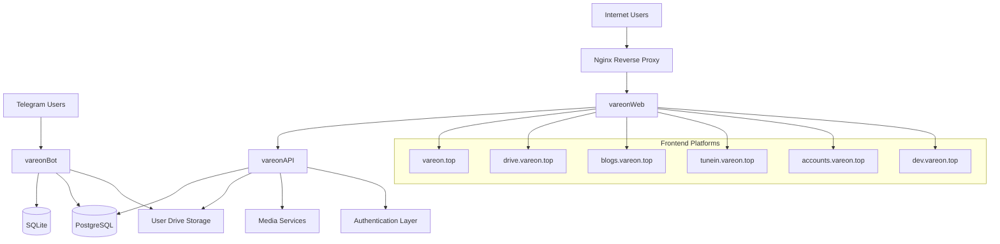
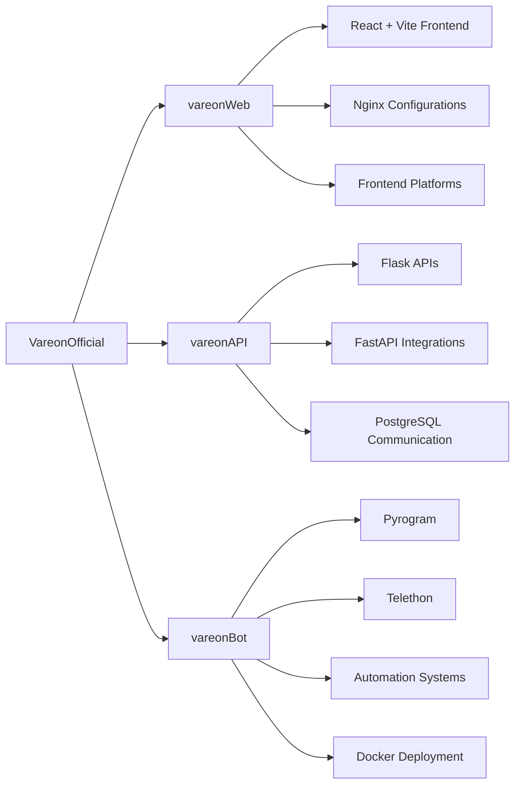
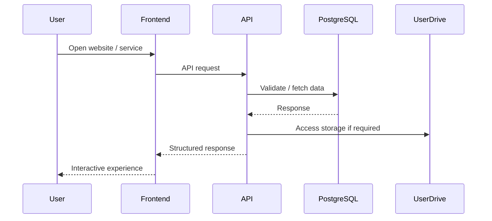
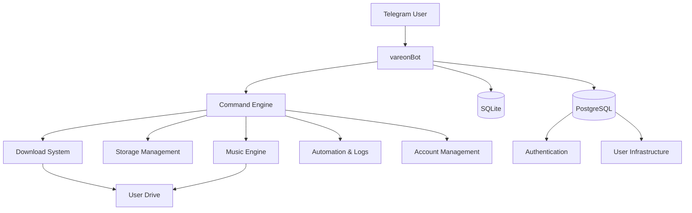
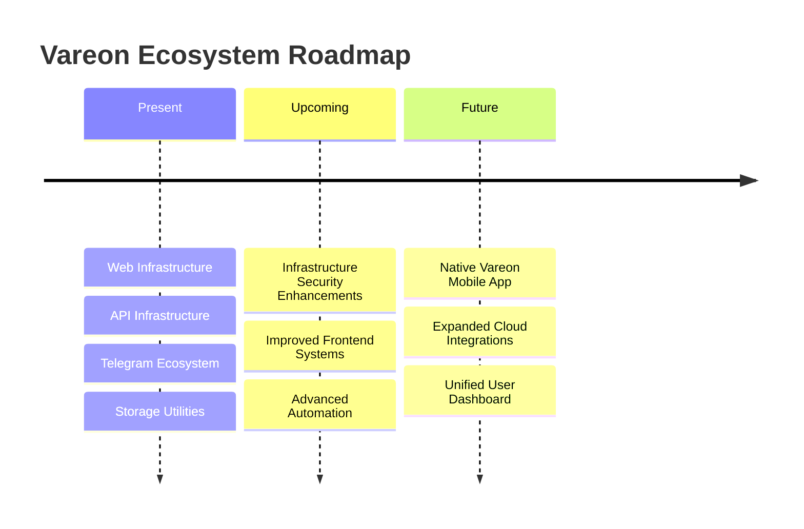

# VareonOfficial

> Building a connected ecosystem of web platforms, APIs, automation systems, and cloud-integrated tools focused on performance, personalization, and secure infrastructure.

---

## Overview

VareonOfficial is a multi-service infrastructure ecosystem composed of frontend platforms, centralized APIs, automation systems, and Telegram-integrated cloud utilities.

The ecosystem is designed around modular architecture, scalable deployment, and personalized user experiences for friends, family, and private platform users.

The infrastructure currently powers:

- Web platforms
- Authentication systems
- Cloud-integrated storage utilities
- Telegram automation tools
- Media and music services
- Developer environments
- Secure API communication
- Multi-service user management

---

# Ecosystem Architecture

---

# Repository Structure

---

# Request & Communication Flow

---

# Telegram Bot Flow

---

# Core Technologies

## Frontend

- React
- Vite
- JavaScript
- HTML/CSS
- Nginx

## Backend

- Flask
- FastAPI
- PostgreSQL
- Docker

## Automation & Bot Infrastructure

- Python 3.14
- Pyrogram
- Telethon
- SQLite
- Telegram Bot API

---

# Infrastructure Philosophy

The Vareon ecosystem is designed around:

- Modular infrastructure
- Independent service deployment
- Secure backend communication
- Personalized cloud interactions
- Automation-first workflows
- Lightweight scalable architecture
- Private ecosystem management

The objective is to build a reliable infrastructure that feels seamless for end users while remaining developer-friendly internally.

---

# Current Services

| Platform | Purpose |
|---|---|
| `vareon.top` | Main ecosystem entry point |
| `drive.vareon.top` | File & storage utilities |
| `blogs.vareon.top` | Blog platform |
| `tunein.vareon.top` | Music & media services |
| `accounts.vareon.top` | Account management |
| `dev.vareon.top` | Internal development/testing |

---

# vareonBot Features

The Telegram infrastructure currently supports:

- Direct link downloading
- Telegram file transfers
- YouTube downloads
- Cloudflare-protected links
- Storage management
- File operations
- Compression & extraction
- Personalized activity systems
- Music downloading
- Cookie-based integrations
- User account systems
- Automation workflows

---

# Future Roadmap

---

# Upcoming: Vareon Mobile App

A dedicated mobile application is currently planned for the ecosystem.

The future mobile platform aims to provide:

- Faster file access
- Better storage management
- Simplified media handling
- Personalized cloud interaction
- Unified ecosystem access

---

# Development

The ecosystem is actively maintained and expanded by the Vareon development infrastructure.

The architecture continues evolving toward better scalability, performance, and security.

---

# Privacy & Policies

Users are encouraged to review platform privacy policies and terms before using ecosystem services.

---

# Main Entry Point

🌐 https://vareon.top

---

# Organization Repositories

- `vareonWeb`
- `vareonAPI`
- `vareonBot`

---
